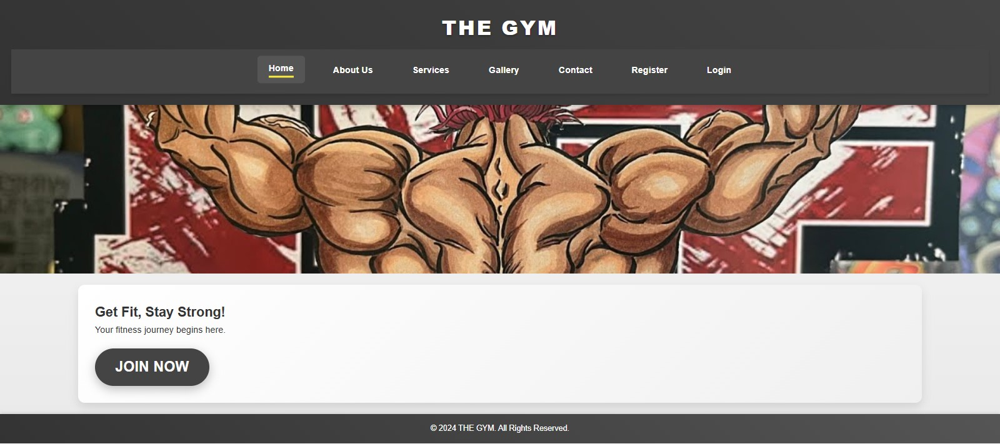
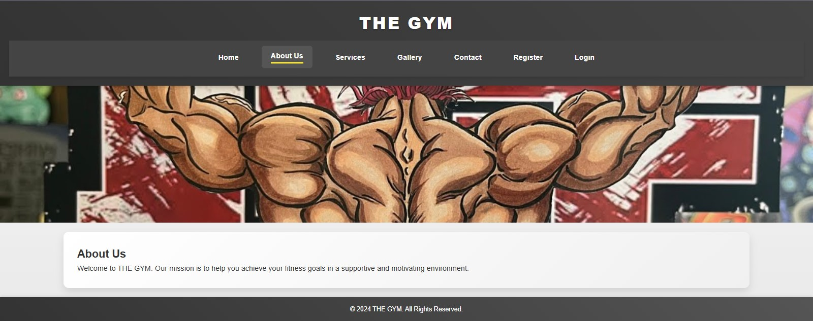
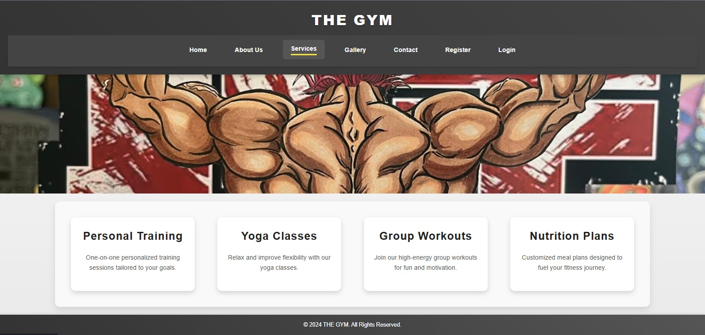
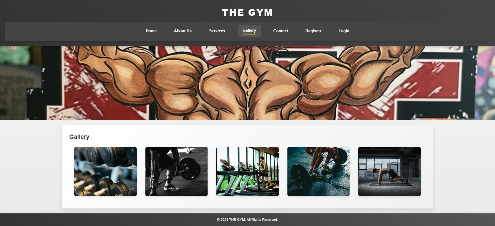
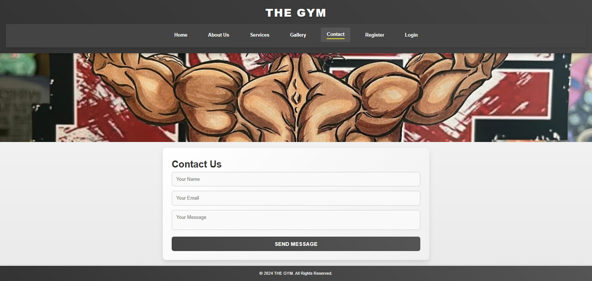
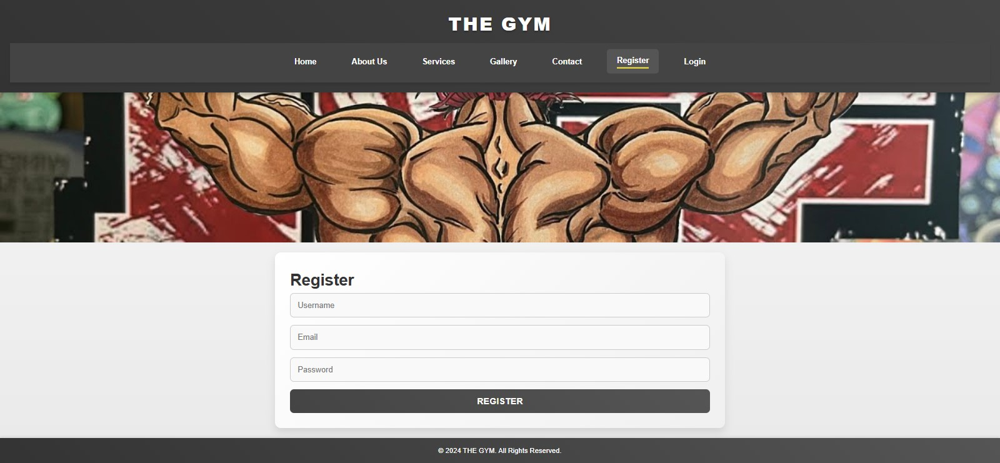
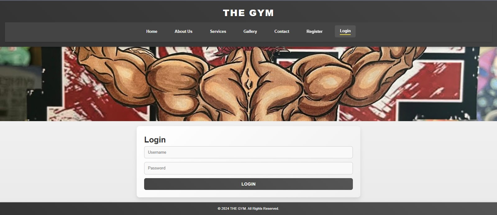

# Static Gym Website

## Description
This is a static website built using Flask (Python), HTML, and CSS. The website includes multiple pages such as Home, About, Gallery, Contact, Login, Registration, and Services.

## Features
•	Home Page: A welcoming introduction to the gym and its offerings.<br>
•	About Page: Detailed information about the gym, its history, and mission.<br>
•	Gallery Page: A collection of images showcasing gym facilities and events.<br>
•	Contact Page: A form for visitors to reach out with inquiries.<br>
•	Login Page: A secure login form for registered users.<br>
•	Registration Page: A registration form for new users.<br>
•	Services Page: Detailed descriptions of the services offered by the gym.<br>

## How to Run the Website (Beginner's Guide)
## Prerequisites
•	Python 3.x installed on your system.<br>
•	Pip for managing Python packages.

## Installation Steps
1.	Clone the Repository:
```bash
git clone https://github.com/Mukhdoom-Hammad-Khan/Static-Gym-Website.git
```

2.	Navigate to the Project Directory:
```bash
cd Static-Gym-Website
```

3.	Install Required Dependencies:
```bash
pip install -r requirements.txt
```

4.	Run the Flask Application:
```bash
python app.py
```

5.	Access the Website:

Open your web browser and visit: http://localhost:5000

## Troubleshooting Tips
•	Ensure Python and pip are correctly installed.<br>
•	If you encounter errors, run: pip install --upgrade pip pip install flask

## Screenshots









## Contact
For any questions or issues, feel free to contact:<br>
Email: hammadahmedopx@gmail.com<br>
GitHub: Mukhdoom Hammad Khan (https://github.com/Mukhdoom-Hammad-khan)

Author: Mukhdoom Hammad Khan
## License
This project is licensed under the [MIT](LICENSE).
